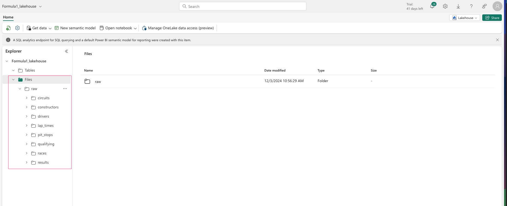
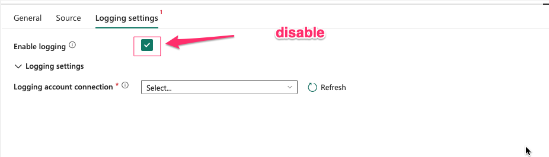
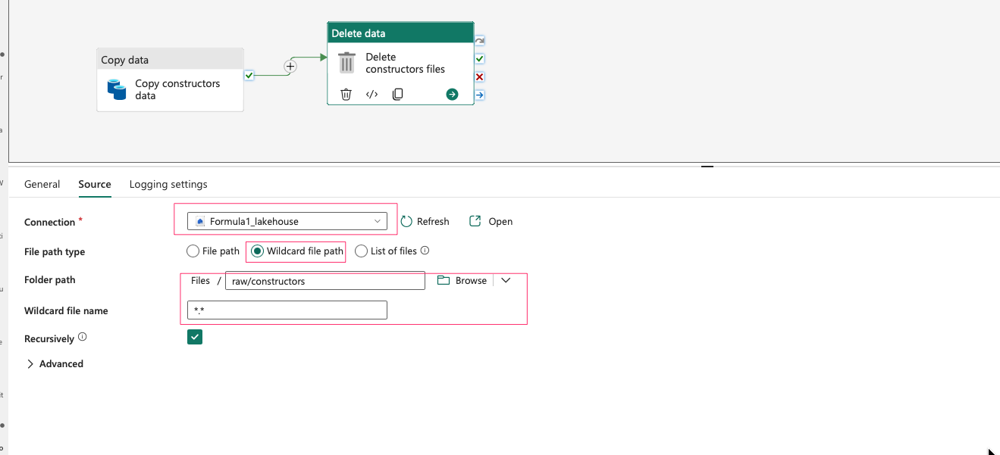
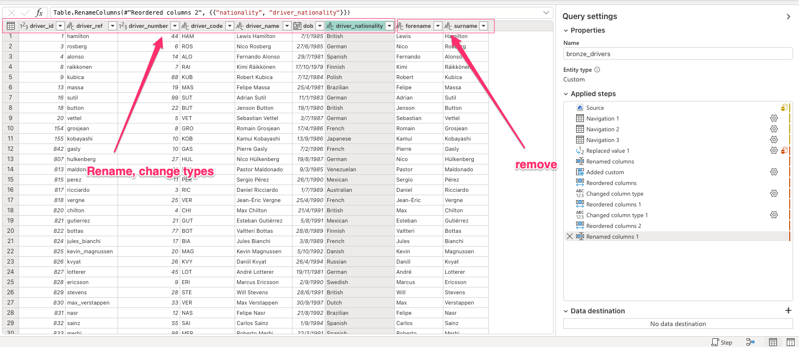
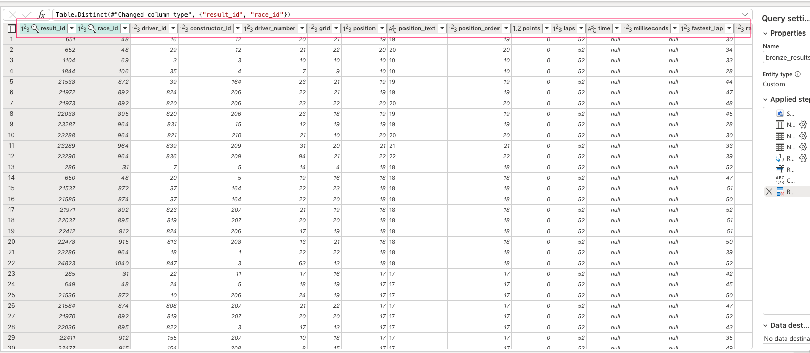
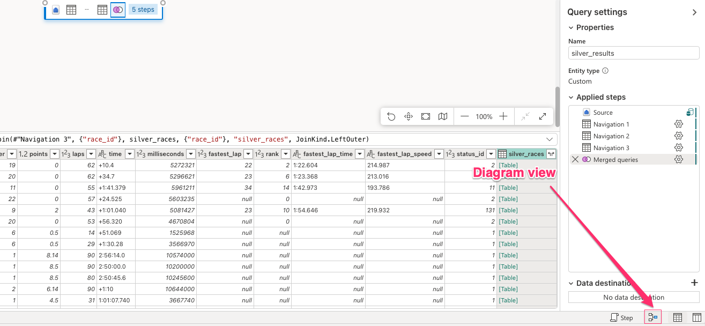

# data_engineering_with_MSFabric
Setup Workspace

In the newly generated Workspace, create a new lakehouse to ingest raw data:

1. Data Ingestion:
In the lakehouse, create subfolders with the hierachy as below:

Upload raw data into each sub-folders:

Create a new data warehouse to store ingested data:

In workspace, create a new folder to store data pipelines:

1.1 Ingest circuits data:

- In the pipeline folder, create a new pipeline to ingest circuits data:

- Name the pipeline as "pl_ingest_circuits", then add "Copy Data" activity into the pipeline canva:

- Select data source as the circuits.csv file in the lakehouse:

- Also choose destination as data lakehouse and create a new table called "bronze_circuits":

- In "Mapping" tab, click on "Import schema". I'll remove "url" column since I won't need it in the future.

- Add "Delete data" activity to delete the source file after being copied:

- Use wildcard file path to make sure all circuits file will be deleted:

- For the purpose of this lab, I won't save logging data. However, you can save logging data into a ADLS2 by setting up connection in Logging Settings tab:

- Validate then run the pipeline:

- When your pipeline has run successfully, go to lakehouse to see if a table brone_circuits has been created under Tables and circuits.csv was deleted from circuit folder.

1.2 Ingest Constructors data:
In the data pipeline folder, create a new pipeline to ingest constructors data:

- Add "Delete data" activity:

1.3 Ingest rivers, pit stops, results and status data:

- Repeat these above to ingest drivers, pit stops and results data into data lakehouse.

1.4 Ingest races data:

- To ingest races data, let's try another method. First, create a new notebook or use the notebook available in this repo:

- Create a new pipeline and add "Notebook" Activity into pipeline canva:

- In the Settings tab, look for the notebook we have created:

1.5 Ingest lap times data:

- Repeat 1.4 to ingest lap times data:

1.6 Ingest qualifying data:

- How to ingest qualifying data is pretty the same as others. However, since there are multiple qualifying files, we need to use "Wildcard file path" instead of File path:

2. Process Data:

2.1:
- Circuits data: create a new Dataflow Gen2

- Rename the dataflow

- Import circuits data from data warehouse:

- Search for Lakehouse:

- Select circuits table from the warehouse:

- Now we can transform circuits data. Basically, I'll standardize column names, make them meaningful and remove unecessary columns:

- Firstly, let's replace all "\N" values by "null". Select all columns, then click on Transform tab --> Replace values:

- Rename column headers and change data types (please refer to data types table):

- After finish transforming, next step is to add data destination:

- Click on Publish to run the dataflows.

- In warehouse, you'll see a new table silver_circuits created under dbo schema. Since Fabric does not give us permission to select a new schema yet, later we'll change all the newly created tables into silver schema.

2.2: Process races data:

- Repeat the same steps to process races data. The transformation is pretty the same which is to rename some columns and remove unecessary ones.

- Replace all "\N" values by null:

- Rename, change data type, and remove columns:

2.3: Process constructors data:

- Rename column headers

2.4: Process drivers data:
- Besides changing column names, we need to join forename and surename of drivers into a new column called name. In the Add Column tab, select Custom Column:

- Rename, change data types and remove columns:

2.5: Process lap times data:

- With lap times, I'll try another method which is using SQL query. In data warehouse, create a new SQL query:

- Create a transformation procedure for later use:

2.6: Process results data:
- Remove duplicate values in both result_id and race_id

- Rename columns:

2.7: Process pit stops data:

2.8 Process status data:

3. Presentation:
3.1 Race result summary table:

- In workspace, create a new dataflows, then name it df_pres_race_results:

- This time, import data from data warehouse, select all silver tables:

- Change mode to diagram view:

- First we need to merge results table and races table. Click on the 3-dot option on results table, then Merge Queries. Merge those 2 tables by race_id column.

- In the races table, select the following columns:

- From this merged table, we will merge with circuits table. Click on the 3-dot option, then Merge Queries. Select the merge column as circuit_id:

- Repeat the above steps to merge with drivers, constructors and status tables:
    - Constructor

    

    - Drivers:

    

    - Status:

    

- Select all the needed columns and remove the rest:

- Save to a new table in data warehouse:

3.2 Race count measure table:

- In this step, I'll try to create a mesaure table using SQL. In data warehouse, create a new SQL query:

- Create a procedure:

4. Power Bi Report:

- In the data warehouse, click on tab Reporting then create a New report:

- You can select all the processed table or only the table in the gold layer. In this lab, I'll select only the gold tables:

- In the Model Layouts mode, connect 2 gold tables by race_year:

- Now you are ready for your report. Below is an example which is replicated the report here [https://community.fabric.microsoft.com/t5/Data-Stories-Gallery/F1-Dashboard/m-p/2273936]

5. Add pipeline trigger:

